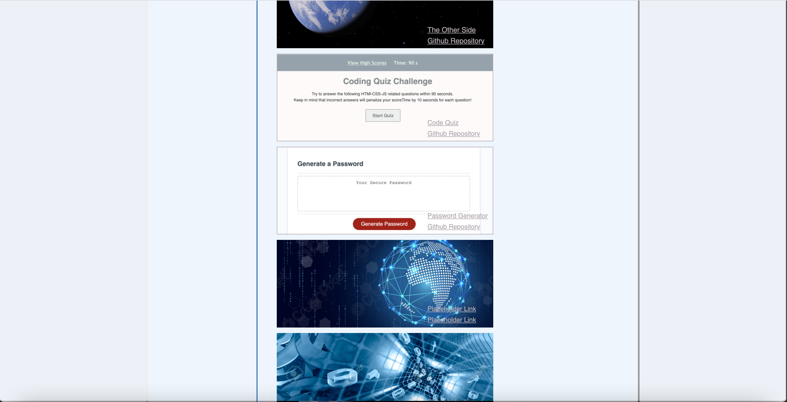

# portfolio-website-ss

## Screenshot

## Description 
HTML:
<header> --> <nav> --> a list of links
<main> with class="content" --> 
** It has 3 sections --> content-about, content-work and content-contact
** Each section has <aside> with a class="side-label-section"

CSS:
** File has necessary comemnts... 

For this project I was required to build a portfolio from scratch. A portfolio is a great way to showcase skills and talents to employers. Not only that, it's a place where you can have all your work for anyone to see and your own reference. It can be a stepping stone to a developer's success. This project was challenging task indeed, writing not only css but html as well from scratch made all the difference. It was a great learning experience.  

## Deployed Application URL
[portfolio-website-ss](https://ssharmin0029.github.io/portfolio-website-ss/)